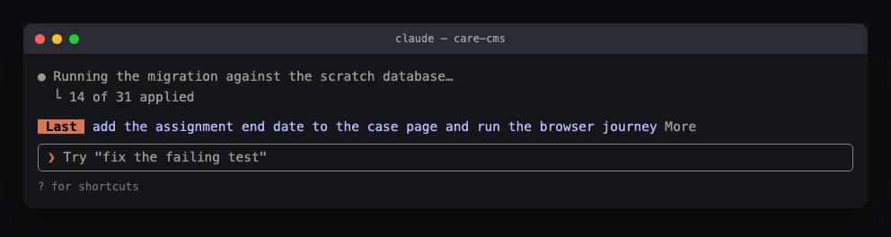

# Last Prompt Band

A small [Claude Code](https://claude.com/claude-code) mod that keeps the prompt you last typed on a row above the prompt line, for as long as the turn runs.



## Why it helps

Claude Code turns can run for minutes. Three things happen in that time:

1. **You switch windows.** With several iTerm tabs each running a session, Cmd+Tab shows you a wall of scrolling tool output that all looks the same. The band tells you which window is which at a glance, because the thing you asked for is sitting right above the prompt in every one of them.
2. **The output buries your question.** A long run of tool calls pushes your prompt off the top of the screen. Scrolling back to read what you asked is a small cost you pay over and over.
3. **You come back to a finished turn.** You left it working, you got coffee, and now there is an answer on screen with no question attached to it.

The band is one row. It costs nothing to read and nothing to ignore.

## What it does

1. Shows the prompt you last typed, as a ` Last ` chip followed by the text.
2. Truncates to one line. Long prompts get a **More** / **Less** toggle that expands over several rows.
3. Folds multi-line prompts onto one line, so a pasted block does not take over the band.
4. Shows only what **you** typed. Background task notifications, scheduled triggers, peer messages and other plugins all submit prompts through the same event; those are filtered out so they cannot overwrite yours.
5. Yields the row when Claude Code needs it for a survey.

Colours come from Claude Code theme keys rather than fixed values, so the band follows your light or dark theme instead of looking right in one and wrong in the other.

## Install

Clone it anywhere:

```
git clone <your-remote> ~/Projects/claude-mod-last-prompt
```

**For one session:**

```
claude --plugin-dir ~/Projects/claude-mod-last-prompt
```

**For every session on the machine**, add the folder to the `env` block of `~/.claude/settings.json`:

```json
{
  "env": {
    "CLAUDE_CODE_PLUGIN_DIRS": "/Users/you/Projects/claude-mod-last-prompt"
  }
}
```

Separate several folders with `:` (`;` on Windows). This has to go in your user settings; Claude Code ignores `CLAUDE_CODE_PLUGIN_DIRS` set in a project's settings. Restart Claude Code afterwards.

The band appears once you submit your first prompt in a session. Before that it has nothing to show, so it draws nothing.

## Changing the colours

Both colours are in [`hooks/register.tsx`](hooks/register.tsx), on the two `Text` elements:

| Element | Prop | Default |
| --- | --- | --- |
| chip | `backgroundColor` | `claude` (terracotta) |
| chip | `color` | `inverseText` |
| prompt text | `color` | `suggestion` (periwinkle) |

Other theme keys worth trying: `permission`, `planMode` (teal), `autoAccept` and `skill` (purple), `success`, `warning`, `error`, and `subtle` or `inactive` for greys. A raw colour such as `#d77757` works too, but it will not adapt between themes.

A test pins the current choice, so change [`hooks/band.test.tsx`](hooks/band.test.tsx) along with it.

## Developing

```
claude plugin validate .    # manifest, hooks and state contract
claude plugin test .        # 8 tests
```

The mod is three pieces:

1. [`hooks/register.tsx`](hooks/register.tsx) hooks `prompt.submit` to record what you typed, and `ui.render` on `AbovePrompt` to draw the row.
2. [`types/index.d.ts`](types/index.d.ts) declares the two session values it keeps, which `claude plugin validate` holds it to.
3. [`.claude-plugin/plugin.json`](.claude-plugin/plugin.json) is the manifest.

Saving a file reloads the mod in any session watching the folder, so you can edit it while it runs.

## Requirements

Claude Code 2.1.287 or newer, which is the release that added mods.

## Licence

MIT.
